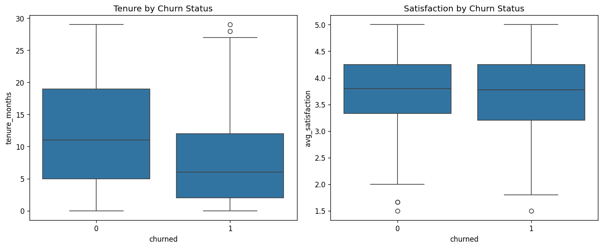
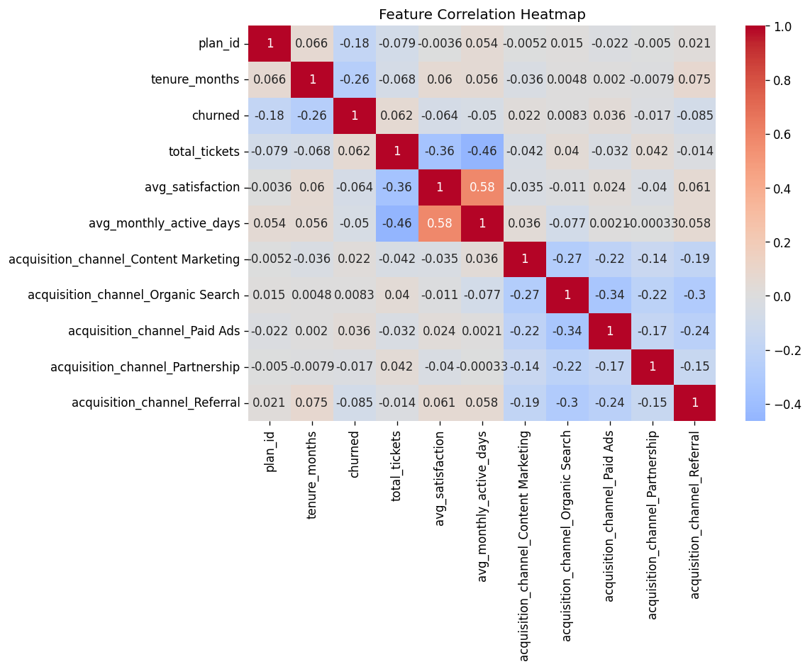

# PulseMetrics — Churn Prediction (Project 2)

**Tools:** Python (pandas, scikit-learn, matplotlib, seaborn) in Jupyter
**Project Type:** A portfolio project that builds on the PulseMetrics SaaS dataset used in
[Project 1](https://github.com/ganeshshiv-code/pulsemetrics-churn-retention-analysis)

## Business Context

Project 1 helped explain **who churned and when** using SQL and a Power BI dashboard. Building on that analysis, this project asks the next business question: **Can we identify customers who are at risk of churning before they actually leave?**

## Finding

Tenure and plan tier were the strongest predictors of churn. Newer customers on lower-tier plans were consistently more likely to leave. Support ticket volume and satisfaction showed very weak linear correlation with churn (0.06 and -0.06), but my Project 1 SQL bucket analysis revealed a clear pattern among customers with **8+ support tickets**. This shows that correlation alone can miss important patterns that appear only in specific groups. After tuning, the model achieved **67.9% recall**, correctly identifying around **2 out of every 3 customers** who eventually churned.

**Business Impact:** For churn prediction, missing a customer who is about to leave is more costly than contacting a customer who was not actually going to churn. That's why I prioritized improving recall, even though it resulted in more false positives. The model provides an early warning system that helps the business take action before customers leave.

**Recommendation:** Score all active customers monthly using this model and prioritize retention efforts for those identified as high risk. Focus especially on newer customers, lower-tier plans, and customers with high support ticket volume by using proactive onboarding and targeted retention campaigns.


## Methodology

1. **Feature engineering** — aggregated `support_tickets` and `monthly_usage`
   (originally one-row-per-ticket / one-row-per-month) down to one row per
   customer *before* merging, to avoid row-count fan-out. Nulls from customers
   with zero tickets were filled contextually (0 for count, dataset mean for
   satisfaction — not the same fill for both, since a 0 satisfaction score
   would falsely imply extreme dissatisfaction).
2. **Encoding** — `acquisition_channel` (nominal) one-hot encoded;
   `plan_id` (ordinal, real tier order) left as-is.
3. **Modeling** — logistic regression, with a baseline run vs. a
   `class_weight='balanced'` run to correct for the ~65/35 class imbalance.
   Baseline recall (28.3%) actually underperformed the naive "predict majority
   class" floor (65% accuracy) — the balanced model raised recall to 67.9% at
   a small accuracy cost, a deliberate and justified trade-off for this
   business problem.
4. **Feature importance** — standardized coefficients confirm `tenure_months`
   and `plan_id` as the strongest predictors, consistent with Project 1's SQL
   findings. `total_tickets` and `avg_satisfaction` are correlated with each
   other (-0.36, multicollinearity), which explains why the model concentrates
   weight on one over the other rather than double-counting the same signal.

## Visuals




## Repo Structure

```
├── README.md
├── notebook/
│   └── project2_churn_prediction.ipynb
└── images/
    ├── tenure_satisfaction_boxplots.png
    └── correlation_heatmap.png
```
